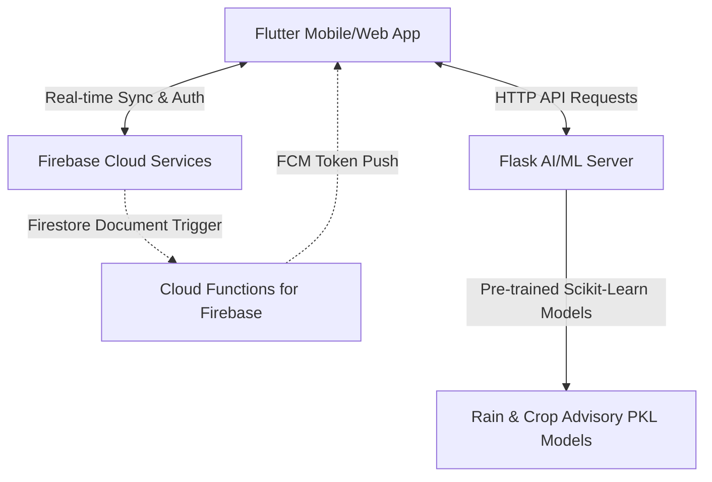

# 🌾 IntelliFarm — Intelligent Smart Farming Platform

IntelliFarm is a state-of-the-art agricultural logistics, IoT, and AI-enabled marketplace application built using **Flutter** and **Firebase**. Designed to bridge the gap between farmers, dealers, and logistics drivers, the platform delivers real-time weather analytics, predictive crop advisories, live IoT sensor monitoring, automated transport dispatching, and bilingual AI chatbot consultations.

---

## 📖 Table of Contents
1. [Platform Architecture](#-platform-architecture)
2. [Core Roles & Features](#-core-roles--features)
   - [Farmer Panel](#1-farmer-panel)
   - [Dealer Panel](#2-dealer-panel)
   - [Driver Panel](#3-driver-panel)
   - [Employee Lookup](#4-employee-lookup)
3. [Smart Systems & AI/ML Integrations](#-smart-systems--aiml-integrations)
   - [IoT Soil Moisture Tracking](#iot-soil-moisture-tracking)
   - [Machine Learning Rain Prediction](#machine-learning-rain-prediction)
   - [Agronomic Crop Advisory](#agronomic-crop-advisory)
   - [Bilingual Chatbot](#bilingual-chatbot)
4. [Firestore Database Schema](#-firestore-database-schema)
5. [Project Structure](#-project-structure)
6. [Installation & Setup](#-installation--setup)
   - [Prerequisites](#prerequisites)
   - [Mobile Application Setup](#mobile-application-setup)
   - [Firebase Backend Setup](#firebase-backend-setup)
   - [Flask AI/ML Backend Setup](#flask-aiml-backend-setup)
7. [How to Run](#-how-to-run)
   - [1. Installing the Prebuilt APK](#1-installing-the-prebuilt-apk)
   - [2. Launching in Flutter Development Mode](#2-launching-in-flutter-development-mode)
   - [3. Running the Python/Flask ML Server](#3-running-the-pythonflask-ml-server)
   - [4. Running Firebase Services](#4-running-firebase-services)
8. [Licensing & Security](#-licensing--security)

---

## 🏗 Platform Architecture

The IntelliFarm system operates on a decentralized, three-tier cloud-based architecture:



- **Client App (Flutter):** Provides the cross-platform UI, handling localization, state management, local device geolocating, and interactive sensor dashboards.
- **Backend (Firebase):** Manages user accounts (Firebase Auth), real-time document syncing (Firestore), profile assets (Firebase Storage / FreeImage Host), and push notification dispatch (Cloud Functions & FCM).
- **AI/ML Middleware (Flask Server):** Exposes RESTful endpoints running predictive models (`.pkl`) for weather, crop health diagnostics, and generative chatbot prompts.

---

## 👥 Core Roles & Features

### 1. Farmer Panel
- **Telemetry Dashboard:** Live tracking of temperature, local climate, and real-time soil moisture levels sync'd directly from fields.
- **Logistics Dispatch:** Select from approved nearby transport drivers, view active rates per kilometer, and issue automated pickup requests.
- **Bilingual AI Chatbot:** Seek instant guidance on soil health, pest management, and cultivation in English or Tamil.
- **Product Marketplace:** List crops for sale complete with photos, target pricing, quantities, and descriptors. Receive and negotiate dealer offers.
- **Crop Advisory:** Browse 35+ crop varieties to view customized farming calendars, sowing guides, and fertilizer recommendations.
- **Government Schemes:** Quick-access integration for major agricultural schemes like *PM-KISAN*, *Soil Health Card*, and *PMFBY*.
- **Direct Dialing Support:** Browse local agricultural supply stores and phone them immediately for seeds, tools, and fertilizers.

### 2. Dealer Panel
- **Marketplace Browsing:** Real-time search of crops and agricultural goods uploaded by local farmers.
- **Bidding System:** Propose purchase prices and dispatch inquiries on available products.
- **Direct Chat:** Engage in direct, real-time messaging with farmers to negotiate prices and pickup timelines.
- **Logistics Integration:** Request and assign transport drivers directly to purchased farmer lots.
- **Weather Warnings:** Keep track of weather dynamics at the farmer’s location to prepare transit vehicles.

### 3. Driver Panel
- **Role Verification:** Submits official commercial driving licenses and date-of-birth records. Driver status is marked as `pending` until approved by platform administrators.
- **Availability Toggle:** Switch status between `Online` and `Offline` to appear in search queries.
- **Dynamic Pricing:** Set and update standard transport rates (₹ per kilometer) displayed to farmers and dealers.
- **Request Management:** View incoming logistics requests detailing pickup addresses, drop addresses, cargo loads, dates, and times. Instantly Accept or Reject requests.

### 4. Employee Lookup
- **Staff Visual Board:** A catalog listing details and direct phone links for verified on-field agricultural officers, workers, and delivery drivers.

---

## ⚡ Smart Systems & AI/ML Integrations

### IoT Soil Moisture Tracking
Using a custom hardware or virtual soil sensor, data is pushed to the `soilmoisture` collection.
- **Calibration Engine:** Normalizes analog sensor readings between calibrated minimum (`2700`) and maximum (`3100`) thresholds.
- **Status Classification:** Translates percentage bounds to actionable states:
  - **$\ge$ 70%**: Wet (No watering required)
  - **40% - 69%**: Moderate
  - **< 40%**: Dry (Triggers alerts)
- Updates are automatically reflected on the Farmer's profile status in real-time.

### Machine Learning Rain Prediction
A predictive classifier determines the probability of rainfall using key variables:
- Integrates geolocation APIs to retrieve real-time regional **Temperature**, **Humidity**, and **Wind Speed** values.
- Issues a POST request to `/predict` on the Flask ML engine running `rain_prediction_model.pkl`.
- Displays real-time rain warnings to help farmers secure harvests or adjust watering frequencies.

### Agronomic Crop Advisory
Supports expert-level support for 35 key crops (including Tomato, Paddy, Brinjal, Cotton, Sugarcane, Mango, Wheat, and Garlic):
- Queries `/get_advisory?crop=<CROP>` on the Flask server.
- The Flask endpoint processes `crop_advisory_model.pkl` to fetch customized step-by-step guidance.
- Displays recommendations organized by sowing, growth, pest mitigation, and harvest phases.

### Bilingual Chatbot
- Employs a custom generative language wrapper.
- Offers dual-language input: Users can toggle translation between **English** and **Tamil** (`தமிழ்`).
- Uses the `translator` plugin to parse input phrases, send queries to the backend chatbot engine (`/chat`), and translate answers back to the user's selected language.

---

## 🗄 Firestore Database Schema

The database utilizes five primary root collections:

### 1. `users`
Represents platform members and role-specific metrics.
```json
{
  "uid": "USER_UNIQUE_IDENTIFIER",
  "name": "User Display Name",
  "email": "user@example.com",
  "role": "Farmer | Dealer | Driver",
  "contact": "+91XXXXXXXXXX",
  "profileImageUrl": "https://freeimage.host/...",
  "createdAt": "TIMESTAMP",
  "sensorId": "SENSOR_DOC_ID (Farmer only)",
  "sensorLinked": true,
  "status": "Dry | Moderate | Wet (Farmer only)",
  "licenseNumber": "LIC_XXX (Driver only)",
  "dob": "YYYY-MM-DD (Driver only)",
  "driverStatus": "pending | approved (Driver only)",
  "isOnline": true,
  "ratePerKm": 15.5
}
```

### 2. `products`
Houses agricultural product listings created by farmers.
```json
{
  "productId": "AUTO_GENERATED_ID",
  "farmerId": "FARMER_UID",
  "productName": "Paddy",
  "price": 2400.0,
  "quantity": "500 kg",
  "imageUrl": "https://...",
  "timestamp": "TIMESTAMP"
}
```
*Sub-Collection:* `products/{productId}/offers` — Holds bids placed by dealers.

### 3. `dealer_orders`
Tracks purchase agreements made between dealers and farmers.
```json
{
  "orderId": "AUTO_GENERATED_ID",
  "productId": "PRODUCT_DOC_ID",
  "farmerId": "FARMER_UID",
  "dealerId": "DEALER_UID",
  "price": 2350.0,
  "status": "accepted | pending | completed"
}
```

### 4. `driver_requests`
Stores dispatch requests sent to logistics drivers.
```json
{
  "requestId": "AUTO_GENERATED_ID",
  "from": "FARMER_UID | DEALER_UID",
  "to": "DRIVER_UID",
  "pickup_address": "Farmer Location",
  "drop_address": "Dealer Location",
  "load": "500 kg Paddy",
  "date": "YYYY-MM-DD",
  "time": "HH:MM",
  "status": "pending | accepted | rejected"
}
```

### 5. `soilmoisture`
Maintains telemetry data streamed from fields.
```json
{
  "sensorId": "SENSOR_DOC_ID",
  "moisture": 2850
}
```

---

## 📁 Project Structure

```text
├── android/                   # Android Platform configurations
├── ios/                       # iOS Platform configurations
├── web/                       # Flutter Web integration
├── windows/                   # Windows Desktop build directory
├── macos/                     # MacOS Desktop build directory
├── linux/                     # Linux Desktop build directory
├── assets/                    # Image assets & crops indicators
├── functions/                 # Firebase Cloud Functions (Node.js)
│   ├── index.js               # FCM push notifications trigger
│   ├── package.json           # Node dependencies
│   └── .eslintrc.js           # Linter configuration
├── firestore.rules            # Firestore security rules config
├── storage.rules              # Firebase Storage rules config
├── firebase.json              # Firebase Deploy deployment settings
└── lib/                       # Flutter Application source code
    ├── main.dart              # Main application entry point & routing
    ├── login_page.dart        # Login screen
    ├── register_page.dart     # User registration with image host & role selection
    ├── farmer_home.dart       # Farmer dashboard (Sensor gauges, Weather, Quick actions)
    ├── dealer_home.dart       # Dealer dashboard
    ├── driver_home_page.dart  # Driver console (Online toggle, Pricing, Requests)
    ├── linknow.dart           # IoT moisture sensor configuration page
    ├── chatbot.dart           # AI Chatbot widget with English/Tamil translator
    ├── rain_prediction.dart   # Weather API fetcher & Rain Predict ML connector
    ├── crop_advisory_page.dart# Crop grid display connecting to ML Flask advisories
    ├── crop_details_page.dart # Advisory details renderer
    ├── marketplace_page.dart  # Marketplace directory
    ├── product_upload_page.dart# Farmer product upload interface
    ├── order_detail_page.dart # Detailed order logistics sheet
    ├── driver_list_page.dart  # List of drivers (Dealer & Farmer view)
    ├── employee_page.dart     # Field officers & staff contact book
    ├── NearbyShopsPage.dart   # Local agricultural shop listing
    └── chat_page.dart         # Direct messaging interface
```

---

## ⚙ Installation & Setup

### Prerequisites
* Flutter SDK (version `3.x` recommended)
* Node.js (version `22` for Cloud Functions)
* Python `3.8+` (for running the Flask AI/ML server)
* Firebase CLI tools

### Mobile Application Setup
1. Clone the project files to your system.
2. In the project root, download the required Flutter dependencies:
   ```bash
   flutter pub get
   ```
3. Register your app with your Firebase console to acquire the `google-services.json` (Android) or `GoogleService-Info.plist` (iOS) configuration files. Place them in the respective platform-specific directories (`android/app/` and `ios/Runner/`).
4. Replace API Keys in code files:
   - Weather Forecast: Edit API Key in `lib/weather_page.dart` (`apiKey`).
   - Rain Prediction: Edit API Key in `lib/rain_prediction.dart` (`weatherApiKey`).
5. Run the application:
   ```bash
   flutter run
   ```

### Firebase Backend Setup
1. Initialize the project with your Firebase console:
   ```bash
   firebase use --add
   ```
2. Navigate to the `functions/` directory and install the Node modules:
   ```bash
   cd functions
   npm install
   ```
3. Deploy rules, indexes, and cloud functions to Firebase:
   ```bash
   firebase deploy
   ```

### Flask AI/ML Backend Setup
1. Prepare a server environment with Python. Install requirements:
   ```bash
   pip install flask scikit-learn numpy pandas
   ```
2. Place the ML models (`crop_advisory_model.pkl`, `rain_prediction_model.pkl`) inside your server source directory.
3. Configure the Flask routes to read these pickle files:
   * `/predict` (expects POST body with `humidity`, `temperature`, `wind_speed`)
   * `/get_advisory` (expects GET query param `crop`)
   * `/chat` (expects POST body with `prompt`)
4. Adjust the server base URLs in `lib/chatbot.dart`, `lib/rain_prediction.dart`, and `lib/crop_advisory_page.dart` to match your Flask server's local IP or host.
5. Launch the Flask API server:
   ```bash
   python app.py
   ```

---

## 🚀 How to Run

This section outlines how to launch the IntelliFarm ecosystem, whether you are installing the precompiled mobile application or launching the code locally.

### 1. Installing the Prebuilt APK
For quick deployment and review on an Android device or emulator, a precompiled APK is provided directly in the root workspace directory as [Intellifarm App.apk](file:///d:/empty/Intellifarm%20App.apk).

**Installation Steps:**
1. Transfer the [Intellifarm App.apk](file:///d:/empty/Intellifarm%20App.apk) file to your physical Android device, or drag and drop it into an Android Emulator (such as Android Studio AVD, Genymotion, or BlueStacks).
2. On your device, open your File Manager, tap on the APK file, and choose **Install**.
3. If prompted by Android security, enable **"Install from Unknown Sources"** for your file manager or browser.
4. Launch **IntelliFarm** from your app drawer.

---

### 2. Launching in Flutter Development Mode
To run the project in development mode with Hot Reload enabled:
1. Ensure your development environment is set up (see [Mobile Application Setup](#mobile-application-setup)).
2. Connect your Android device via USB debugging or start an emulator.
3. Verify your device connection:
   ```bash
   flutter devices
   ```
4. Run the project in debug mode:
   ```bash
   flutter run
   ```
5. *(Optional)* To build a new production APK release:
   ```bash
   flutter build apk --release
   ```
   The built APK will be generated at:
   `build/app/outputs/flutter-apk/app-release.apk`

---

### 3. Running the Python/Flask ML Server
The app relies on a Flask server for rain prediction, bilingual AI chats, and crop advisory guidelines.
1. Navigate to your Flask server script directory (e.g., where `app.py` resides).
2. Activate your virtual environment and start the Flask development server:
   ```bash
   python app.py
   ```
3. By default, the server runs on `http://127.0.0.1:5000` or the specified local IP. Ensure that the device running the Flutter app can access this IP address (they must be on the same local Wi-Fi network).

---

### 4. Running Firebase Services
* **Real-time database (Firestore):** Syncs automatically with the app once configured with `google-services.json`.
* **Firebase Cloud Functions (Local Emulation):**
  If you want to run Firebase cloud functions locally to test notifications:
  ```bash
  cd functions
  npm run serve
  ```
  This fires up the Firebase Cloud Functions emulator.

---

## 🔒 Licensing & Security
* **Database Access:** Default security configurations permit public read/write requests during local sandbox trials. For production builds, please lock Firestore collections down to authenticated callers:
  ```javascript
  service cloud.firestore {
    match /databases/{database}/documents {
      match /users/{userId} {
        allow read, write: if request.auth != null && request.auth.uid == userId;
      }
      match /{document=**} {
        allow read, write: if request.auth != null;
      }
    }
  }
  ```
* **Storage Access:** Protected under `storage.rules` default settings to block non-verified external file uploads.
